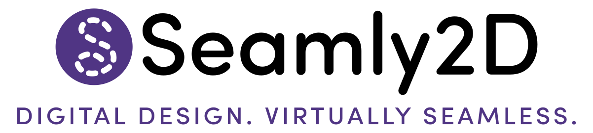

  

# Seamly2D

<big>Seamly2D</big> is pattern design software to create scalable, sharable custom-fit patterns using bespoke tailoring, haute couture, and historical pattern drafting techniques. Seamly2D saves time and improves fit by creating patterns as reusable, editable parametric CAD engineering documents.

Unlike other pattern design software, Seamly2D allows designers to have complete control of the patternmaking process. Each Seamly2D pattern can read multi-size tables for boutique sizing *and* read individual measurement files for custom-fit.

Seamly2D is open source software released under the GPLv3+ license.  Seamly2D is available for Windows, MacOS, and Linux.  

Learn more about Seamly2D by joining our friendly, active user [forum](https://forum.seamly.io) and reading our [Code of Conduct](CODE_OF_CONDUCT.md). On our forum you may post questions about patternmaking and Seamly2D in any language you choose, as sewing terms are rich with idioms that are not always translatable word-for-word.

## Supported platforms:  
   * Windows 10 & 11 (32-bit and 64-bit)
   * Most current Linux distros via [Flathub](https://flathub.org/apps/details/net.seamly.seamly2d)
   * macOS High Sierra 10.13 (64-bit) or later

## Download Seamly2D:

| Windows 64-bit | Windows 32-bit | MacOS | Linux AppImage | Linux Flatpak |
| :---:          | :---:          | :---: | :---:          | :---:         |
|  |  | [<picture><source media="(prefers-color-scheme: dark)" srcset="img/white-apple-logo-transparent-49x60px.png"><source media="(prefers-color-scheme: light)" srcset="img/Apple_logo_black.png" ></picture>](https://github.com/FashionFreedom/Seamly2D/releases/latest/download/Seamly2D-macos.zip) |  |  |

___________________________________________________
## Seamly2D Community Resources:
   * [Website and downloads](https://seamly.io) - _current_  
   * [User Forum](https://forum.seamly.io/) - _current_
   * [User Wiki Manual](https://wiki.seamly.io) - _needs updating_
___________________________________________________

## Seamly2D Developer Resources:
   * [Developer README](README-DEVELOPER.md) - _current_
   * [Developer Wiki](https://github.com/FashionFreedom/Seamly2D/wiki) - _needs updating_
___________________________________________________
## LICENSING

Seamly2D is free software: you can redistribute it and/or modify
it under the terms of the GNU General Public License as published by
the Free Software Foundation, either version 3 of the License, or
(at your option) any later version.  

Seamly2D is distributed in the hope that it will be useful,
but WITHOUT ANY WARRANTY; without even the implied warranty of
MERCHANTABILITY or FITNESS FOR A PARTICULAR PURPOSE.  See the
GNU General Public License for more details.

See our [LICENSE.md](LICENSE.md) file or go to [https://www.gnu.org/licenses/gpl-3.0.html](https://www.gnu.org/licenses/gpl-3.0.html) for further information.

Other components released under:  
* QMuParser - [Simplified BSD license](https://opensource.org/licenses/BSD-2-Clause)
* VPropertyExplorer - [LGPLv2.1 license](https://www.gnu.org/licenses/old-licenses/lgpl-2.1.en.html)
