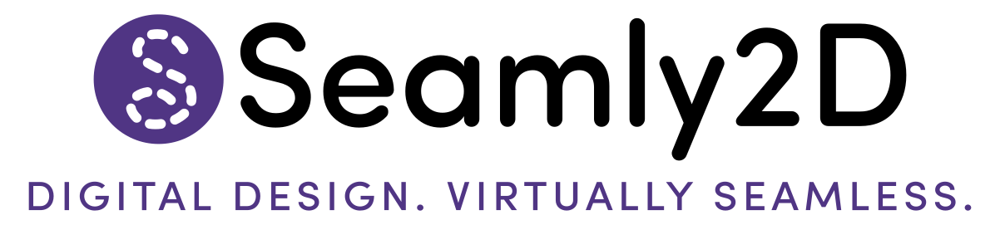

-----

  
  

Click here --><-- to star Seamly2D.

<big>Seamly2D</big> is open source patternmaking software to democratize fashion, released under the GPLv3+ license, and available for Windows, MacOS, and Linux.

Design what **you** want to wear. Each Seamly2D pattern can read multi-size measurement files for standardized sizes *and* read individual measurement files for custom-fit.
Don't know how? Join our multi-lingual Discourse [forum](https://forum.seamly.io).

### Supported platforms:
   * Windows 10 & 11 (64-bit) 
   * macOS Monterey (12), Ventura (13), Sonoma (14), and Sequoia (15)
   * Most current Linux distros as Flatpak via [Flathub](https://flathub.org/apps/io.seamly.seamly2d)
   * Most current Linux distros as AppImage
___________________________________________________
### Download:

| Windows 64-bit | Windows ARM64 | MacOS | Linux AppImage | Linux Flatpak |
| :---:          | :---:         | :---: | :---:          | :---:         |
|  |  |  |  |  |
| Intel or AMD 64bit | ARM 64bit | Apple Silicon or Intel | Intel or AMD 64bit | Intel or AMD 64bit |
| Windows 10 Windows 11 | Windows 11 | macos 12 Monterey macOS 13 Ventura macOS 14 Sonoma macOS 15 Sequoia macOS Tahoe 26 | Debian 10 Buster Debian 11 Bullseye Debian 12 Bookworm Ubuntu 22.04 Jammy Ubuntu 23.04 Lunar Up-to-date Arch Linux - Manjaro ArcoLinux EndeavourOS Anarchy ArchLabs|Debian 10 Buster Debian 11 Bullseye Debian 12 Bookworm Ubuntu 22.04 Jammy Ubuntu 23.04 Lunar Up-to-date Arch Linux - Manjaro ArcoLinux EndeavourOS Anarchy, ArchLabs|

___________________________________________________
### Community :
   * [Website and downloads](https://seamly.io) - _active, current_
   * [User Forum](https://forum.seamly.io/) - _active, current_
   * [User Wiki Manual](https://wiki.seamly.io) - _needs updating_
___________________________________________________

### Developer :
   * [Developer README](README-DEVELOPER.md) - _current_
   * [Developer Wiki](https://github.com/FashionFreedom/Seamly2D/wiki) - _needs updating_
   * [Doxygen docs](https://fashionfreedom.github.io/Seamly2D/) - _current_
___________________________________________________
### LICENSING

See [https://www.gnu.org/licenses/gpl-3.0.html](https://www.gnu.org/licenses/gpl-3.0.html) for more information.

Other components and licensing:
* QMuParser - [Simplified BSD license](https://opensource.org/licenses/BSD-2-Clause)
* VPropertyExplorer - [LGPLv2.1 license](https://www.gnu.org/licenses/old-licenses/lgpl-2.1.en.html)
* xerces-c - [Apache License, Version 2.0](https://apache.org/licenses/LICENSE-2.0)
